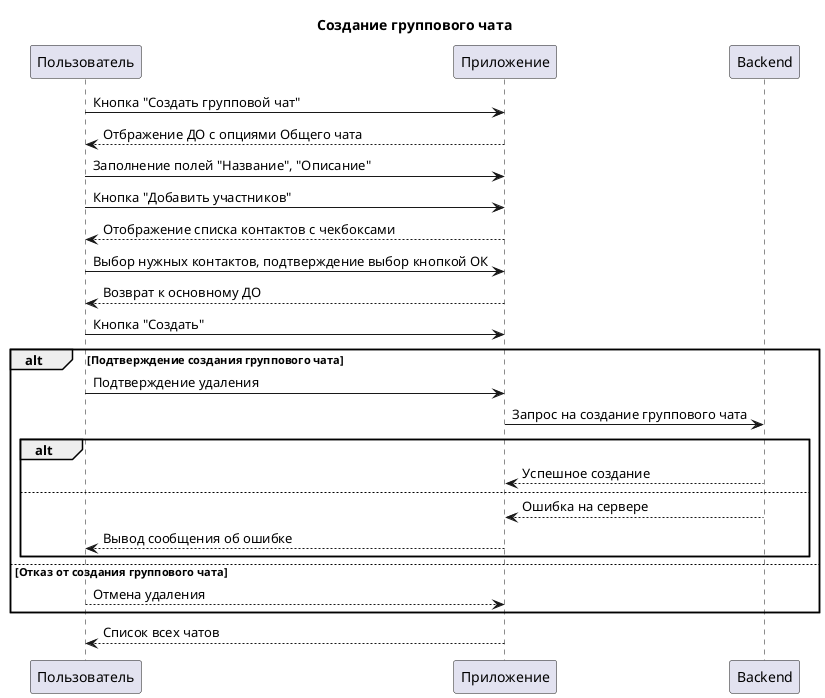
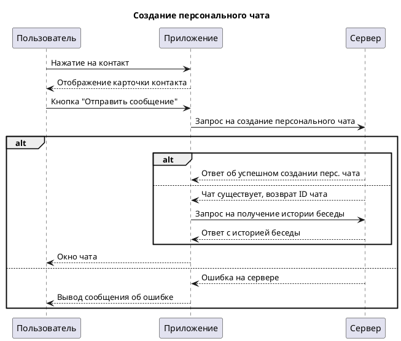

## Групповой чат

```plantuml
@startuml
title Создание группового чата

Пользователь -> Приложение: Кнопка "Создать групповой чат" 
Приложение-->Пользователь: Отбражение ДО с опциями Общего чата 
Пользователь->Приложение: Заполнение полей "Название", "Описание" 
Пользователь->Приложение: Кнопка "Добавить участников"
Приложение --> Пользователь: Отображение списка контактов с чекбоксами
Пользователь -> Приложение: Выбор нужных контактов, подтверждение выбор кнопкой ОК
Приложение --> Пользователь: Возврат к основному ДО
Пользователь -> Приложение: Кнопка "Создать"
alt Подтверждение создания группового чата 
Пользователь->Приложение: Подтверждение удаления
Приложение->Backend: Запрос на создание группового чата
alt
Backend-->Приложение:Успешное создание
else
Backend-->Приложение:Ошибка на сервере
Приложение --> Пользователь: Вывод сообщения об ошибке

end
else Отказ от создания группового чата 
Пользователь-->Приложение: Отмена удаления
end
Приложение-->Пользователь: Список всех чатов
@enduml
```
---

## Персональный чат

```plantuml
@startuml
title Создание персонального чата

Пользователь -> Приложение: Нажатие на контакт
Приложение --> Пользователь: Отображение карточки контакта
Пользователь -> Приложение: Кнопка "Отправить сообщение"
Приложение -> Сервер: Запрос на создание персонального чата
alt
alt
Сервер --> Приложение: Ответ об успешном создании перс. чата
else
Сервер --> Приложение: Чат существует, возврат ID чата
Приложение -> Сервер: Запрос на получение истории беседы
Сервер --> Приложение: Ответ с историей беседы
end
Приложение --> Пользователь : Окно чата
else
Сервер --> Приложение : Ошибка на сервере
Приложение --> Пользователь : Вывод сообщения об ошибке
end
@enduml
```